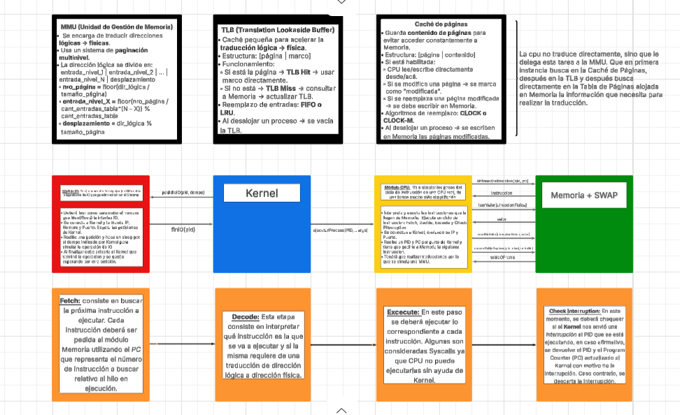
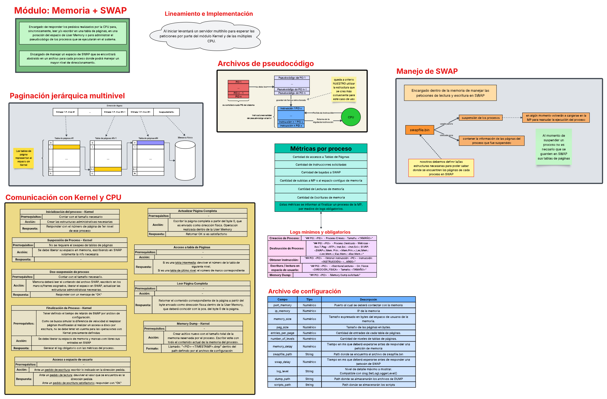

# TP Sistemas Operativos — Episodio IX: The Rise of Gopher

Este proyecto es el trabajo práctico de la materia cuatrimestral **Sistemas Operativos**, centrado en la simulación de un sistema operativo distribuido, desarrollado en **Golang**.

## 📄 Enunciado

Podés consultar el enunciado completo del trabajo en el siguiente enlace:  
🔗 [Consigna del TP — Google Docs](https://docs.google.com/document/d/1zoFRoBn9QAfYSr0tITsL3PD6DtPzO2sq9AtvE8NGrkc/edit?usp=sharing)

---

## Objetivos del TP

- Aplicar conceptos clave de planificación de procesos, administración de memoria y entrada/salida.
- Implementar una arquitectura distribuida con múltiples módulos comunicándose vía HTTP.
- Adquirir experiencia práctica en programación de sistemas con **Golang**.

---

## Arquitectura del sistema

El sistema está dividido en los siguientes módulos:

- **Kernel:** planifica procesos (corto, mediano y largo plazo), administra conexiones con CPU, IO y Memoria.

- **CPU:** interpreta y ejecuta instrucciones, maneja TLB y caché de páginas.

- **Memoria + SWAP:** gestiona espacio de usuario, tablas de páginas y almacenamiento en swap.

[Memoria SWAP (PDF)](memoria/resources/Memoria+SWAP.pdf)
[Memoria Indexado (PDF)](memoria/resources/indexado.pdf)

- **IO:** simula dispositivos de entrada/salida.

Todos los módulos se comunican mediante APIs HTTP, simulando un sistema operativo real distribuido.

---

## ⚙️ Tecnologías utilizadas

- 🟡 [Golang](https://go.dev/)
- 🧪 Testing con scripts y logs
- 🔌 HTTP REST APIs para la comunicación entre módulos
- 🧵 Concurrencia y sincronización

---

## 🗂 Estructura del proyecto

tp-2025/
├── cpu/
├── io/
├── kernel/
├── memoria/
├── utils/
└── scripts/ # pseudocódigos y tests

